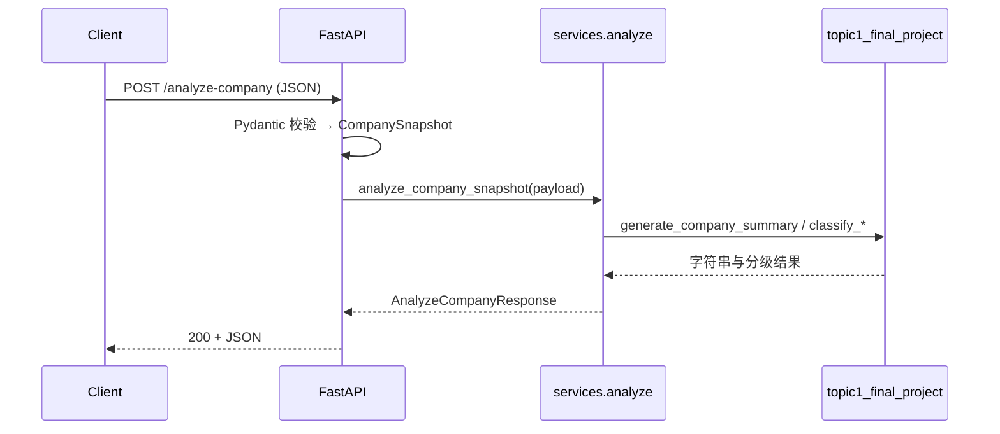

# Topic 2 FastAPI 实战教学文档

本文档与仓库中的 `topics/topic2/fastapi_basics/` 代码一一对应，从零基础可读的角度说明：**接口是什么、本项目如何分层、每个文件做什么、请求如何走到 Topic 1 规则逻辑、如何运行与测试**。  
理论纲要仍以 [`topic2_software_architecture.md`](topic2_software_architecture.md) 为准；本文侧重**动手与对照源码**。

---

## 1. 文档定位与阅读顺序

| 顺序 | 材料 | 用途 |
|------|------|------|
| 1 | [`coding_study_roadmap.md`](coding_study_roadmap.md) Topic 2 小节 | 总体路线与产出检查 |
| 2 | [`topic2_software_architecture.md`](topic2_software_architecture.md) | 架构概念、分层、数据流理念 |
| 3 | **本文** | 对照 `fastapi_basics` 目录逐文件学习与实操 |

---

## 2. 学完本文应掌握的内容

- 能用自己的话说明：**客户端 → FastAPI → 服务层 →（本项目中）Topic 1 函数 → JSON 响应** 的路径。
- 能解释 **`GET` / `POST`**、`JSON` 请求体、**HTTP 状态码**（如 `200`、`422`、`501`）在本项目中的含义。
- 能说明 **Pydantic 模型**如何同时承担「校验」与「API 文档里的字段说明」。
- 能在本仓库内**安装依赖、启动 Uvicorn、访问 `/docs`、用 curl 调通 `/health` 与 `/analyze-company`**。
- 能运行 **`pytest`**，并理解测试在测什么。

---

## 3. 先决条件

- 已学完 Topic 1 中的 Python 基础（变量、字典、函数），并理解 `topics/topic1/topic1_final_project.py` 中的公司与摘要逻辑。
- 本机已安装 **Python 3.9+**（建议 3.10+）。终端能执行 `python -m pip install -r requirements.txt`。
- 无需事先会 FastAPI；文中会按「概念 → 在本项目中的位置」说明。

---

## 4. 本项目解决什么问题

Topic 1 里，分析逻辑跑在**脚本或模块**里。Topic 2 要把能力通过 **HTTP API** 暴露出去，使浏览器、其他程序或自动化脚本可以用统一格式调用。

本项目的原则：

- **API 层（路由）要薄**：只做解析后的输入输出，不写复杂金融规则。
- **领域逻辑**：继续沿用 Topic 1 的 `classify_growth`、`classify_risk`、`generate_company_summary`。
- **契约稳定**：请求与响应用 Pydantic 定义清楚，便于对接前端与后续 LLM/RAG。

---

## 5. 仓库目录结构（与职责）

所有路径相对于仓库根目录 `financial-ai-coding-study/`。

```text
topics/topic2/fastapi_basics/
    requirements.txt          # Python 依赖
    pytest.ini                # pytest 配置（测试路径等）
    README.md                 # 最短运行说明与 curl 示例
    app/
        __init__.py
        main.py               # 创建 FastAPI 应用并挂载各路由模块
        api/
            routes_health.py       # GET /health
            routes_analysis.py     # POST /analyze-company
            routes_placeholders.py # POST /upload-document, POST /ask（占位）
        schemas/
            company.py             # CompanySnapshot、AnalyzeCompanyResponse
        services/
            analyze.py             # 调用 Topic 1 规则并组装响应
    tests/
        conftest.py           # 把项目根加入 Python 路径，保证测试能 import app
        test_api.py           # 对接口的自动化测试
```

**记忆口诀**：`api` 管「门脸」，`schemas` 管「单子长什么样」，`services` 管「办事流程」。

---

## 6. 核心概念速查

### 6.1 什么是 API（应用编程接口）

在此语境下，指一组**约定好的 HTTP 地址 + 方法 + 输入输出格式**。客户端只要按约定发请求，无需知道服务器内部用 Python 还是别的语言实现。

### 6.2 HTTP 方法（与本项目相关）

- **GET**：通常用于**获取**资源、无副作用。本项目 `GET /health` 用于探活。
- **POST**：通常用于**提交**数据供服务端处理。本项目分析公司、上传文档、提问都用 POST（后两者为占位）。

### 6.3 JSON

请求体与大部分响应体使用 **JSON**（键值对、列表等）。FastAPI 会把 JSON 解析成 Pydantic 模型；返回 `dict` 或 Pydantic 模型时会序列化为 JSON。

### 6.4 HTTP 状态码（本项目会出现的）

| 码 | 含义 | 典型场景 |
|----|------|----------|
| 200 | 成功 | `/health`、成功完成 `/analyze-company` |
| 422 | 无法处理实体（校验失败） | 请求 JSON 缺字段、类型不对 |
| 501 | 未实现 | `/upload-document`、`/ask` 在 Topic 2 中为占位 |

---

## 7. FastAPI 在本项目中的用法

### 7.1 应用实例与路由挂载

`app/main.py` 中：

- 使用 **`FastAPI(...)`** 创建应用，传入 `title`、`description`、`version`，这些信息会出现在自动生成的 **Swagger UI**（默认路径 `/docs`）。
- 使用 **`APIRouter`** 把不同功能的接口拆到多个文件，再通过 **`include_router`** 挂到同一个 `app` 上，避免单个文件过长。

### 7.2 路由函数与 OpenAPI

每个路由函数上方的装饰器（如 `@router.get`、`@router.post`）声明了 **URL 路径**和 **HTTP 方法**。FastAPI 据此生成交互式文档，并处理参数解析。

### 7.3 `tags`

各 router 使用 `tags=[...]`，在 `/docs` 里会按标签分组显示，便于阅读。

---

## 8. Pydantic 与请求 / 响应模型

### 8.1 请求模型：`CompanySnapshot`（`app/schemas/company.py`）

- 继承 **`BaseModel`**，字段使用 **`Field(..., description="...")`**。
- `...` 表示**必填**；缺字段时 FastAPI 返回 **422**，并在响应体里说明哪个字段有问题。
- 字段与 Topic 1 里公司字典一致：`name`、`ticker`、`sector`、`revenue_growth`、`pe_ratio`、`debt_ratio`，便于 `model_dump()` 转成字典交给 Topic 1。

### 8.2 响应模型：`AnalyzeCompanyResponse`

- 定义成功返回时 JSON 应包含的字段：`growth_level`、`risk_level`、`summary` 等。
- 在路由上使用 **`response_model=AnalyzeCompanyResponse`**，有助于文档一致性与响应过滤（若将来路由里多了临时字段，也可约束输出形状）。

### 8.3 占位接口里的内联模型

`routes_placeholders.py` 中的 `UploadDocumentBody`、`AskBody` 用于占位接口的请求体验证；将来实现上传与问答时可保留或扩展这些模型。

---

## 9. 逐文件说明

### 9.1 `app/main.py`

- **`create_app()`**：集中创建应用并注册路由，便于测试时复用（测试里直接 `from app.main import app`）。
- **模块级 `app = create_app()`**：供 Uvicorn 使用，命令行写法为：  
  `uvicorn app.main:app --reload`  
  其中 **`app.main`** 是模块路径，**`:app`** 是模块内变量名。

### 9.2 `app/api/routes_health.py`

- **`GET /health`**：返回 `{"status": "ok", "topic": 2}`，用于快速判断服务是否启动。负载均衡或容器探针常用此类接口。

### 9.3 `app/api/routes_analysis.py`

- **`POST /analyze-company`**：函数参数为 **`payload: CompanySnapshot`**，由 FastAPI 自动从请求体解析并校验。
- 函数体内**只调用** `analyze_company_snapshot(payload)`，不包含业务规则，体现「薄路由」。

### 9.4 `app/api/routes_placeholders.py`

- **`POST /upload-document`**、**`POST /ask`**：装饰器中 **`status_code=501`**，表示本期**故意未实现**，与「功能坏了」区分；响应体里用 `detail` 说明后续在哪个主题衔接。
- 使用 **`Optional[str]`** 等类型注解以兼容 Python 3.9（避免在部分环境下使用 `str | None` 语法报错）。

### 9.5 `app/services/analyze.py`

- **`_load_topic1_final_project()`**：用 **`importlib.util.spec_from_file_location`** 按路径加载 `topics/topic1/topic1_final_project.py`。这样不必把 Topic 1 安装成 pip 包，也不用在路由里堆大段复制代码。
- **`analyze_company_snapshot`**：  
  - `payload.model_dump()` → 字典；  
  - 调用 `_t1.generate_company_summary`、`_t1.classify_growth`、`_t1.classify_risk`；  
  - 组装 **`AnalyzeCompanyResponse`** 返回。

**注意**：加载路径依赖「`topic1` 与 `topic2` 在 `topics/` 下同级」这一仓库结构；若单独拷贝目录到别处，需要同步调整路径或改为正式包引用。

### 9.6 `tests/conftest.py` 与 `tests/test_api.py`

- **`conftest.py`**：把 `fastapi_basics` 目录加入 `sys.path`，保证从不同工作目录运行 `pytest` 时仍能 `import app`。
- **`test_api.py`**：使用 **`TestClient`** 在**不启动真实网络端口**的情况下调用应用，断言状态码与 JSON 字段，属于接口级冒烟测试。

---

## 10. 端到端数据流

### 10.1 文字描述

1. 客户端向 `POST /analyze-company` 发送 JSON。
2. FastAPI 将 body 校验并实例化为 **`CompanySnapshot`**；失败则 **422**。
3. 路由调用 **`analyze_company_snapshot`**。
4. 服务层将模型转为 dict，调用 Topic 1 中函数得到摘要与分级标签。
5. 返回 **`AnalyzeCompanyResponse`**，FastAPI 序列化为 JSON，状态码 **200**。

### 10.2 序列图（便于对照架构课）



---

## 11. 环境准备与运行步骤

在仓库根目录或直接进入项目目录均可；下面以进入 `fastapi_basics` 为例。

```bash
cd topics/topic2/fastapi_basics
python -m venv .venv
source .venv/bin/activate
pip install -r requirements.txt
uvicorn app.main:app --reload
```

浏览器打开：**http://127.0.0.1:8000/docs**  
若需指定端口（例如 8000 已被占用）：

```bash
uvicorn app.main:app --reload --port 8001
```

### 11.1 curl 示例

```bash
curl -s http://127.0.0.1:8000/health

curl -s -X POST http://127.0.0.1:8000/analyze-company \
  -H "Content-Type: application/json" \
  -d '{"name":"NVIDIA","ticker":"NVDA","sector":"Semiconductor","revenue_growth":0.35,"pe_ratio":55,"debt_ratio":0.25}'
```

---

## 12. 测试

在 `fastapi_basics` 目录下：

```bash
pytest
```

预期：与 `/health`、`/analyze-company`、两个 501 占位接口相关的用例通过。若本机 `pytest` 较旧，可通过升级 pytest 或确保使用 `python -m pytest` 与当前虚拟环境一致。

---

## 13. 常见问题与排查

| 现象 | 可能原因 | 处理 |
|------|----------|------|
| `Address already in use` | 8000 已被其它进程占用（常与旧 Uvicorn 有关） | 换 `--port`；或结束占用端口的进程后再启动 |
| `ModuleNotFoundError: fastapi` | 未安装依赖或未激活 venv | `pip install -r requirements.txt` |
| `422 Unprocessable Entity` | JSON 缺字段或类型错误 | 对照 `CompanySnapshot` 与 `/docs` 里的 schema 修正请求体 |
| 分析结果异常或导入失败 | Topic 1 文件路径不对或被移动 | 保持 `topics/topic1/topic1_final_project.py` 存在且目录结构未破坏 |

---

## 14. 自测清单（对照路线图产出）

- [ ] 能画出「客户端 → API → 服务 → Topic 1」的方框图（不必精美）。
- [ ] 能独立启动服务并打开 `/docs`。
- [ ] 能用正确 JSON 调通 `/analyze-company` 并读懂返回字段。
- [ ] 能解释为何 `/upload-document` 返回 501 而不是 200。
- [ ] 能成功运行 `pytest` 或通过 `/docs` 手动完成等价验证。

---

## 15. 与后续主题的衔接

- **Topic 3+**：可将 **`/ask`** 接入 LLM；**`/analyze-company`** 可在服务层增加模型推理或混合规则；**`/upload-document`** 可接存储与 RAG。  
- 优先保持 **`schemas` 与 `services` 的扩展**，尽量少改路由函数签名，以降低重构成本。

---

## 16. 命令与路径速查

| 项目 | 值 |
|------|-----|
| Uvicorn 模块路径 | `app.main:app` |
| 工作目录建议 | `topics/topic2/fastapi_basics` |
| 交互式 API 文档 | `http://127.0.0.1:8000/docs` |
| Topic 1 逻辑文件 | `topics/topic1/topic1_final_project.py` |

---

**文档版本**：与仓库 `topics/topic2/fastapi_basics` 当前结构同步；若你移动目录或重命名包名，请同步更新本文第 9.5 节与第 13 节中的路径说明。
