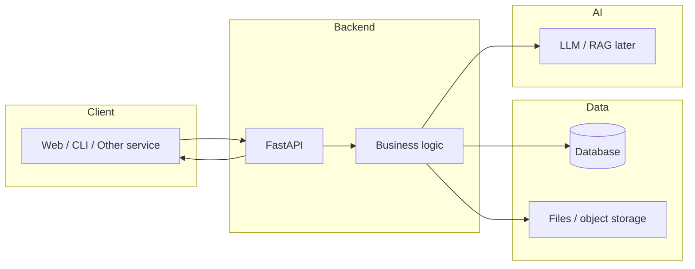
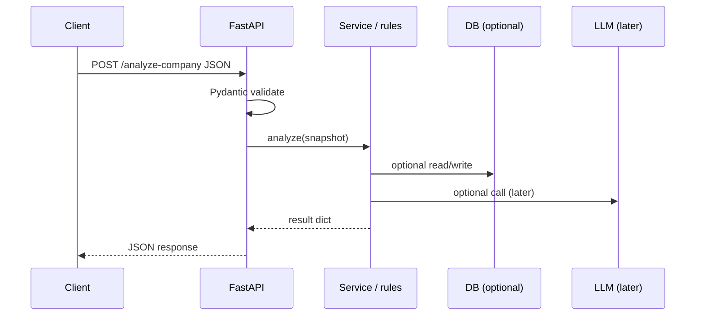

# Topic 2: Software Architecture

# 主题 2：软件架构

## Goal

## 学习目标

My goal is to understand how a real AI application is structured from data input to AI output, and to build a small FastAPI backend that exposes financial / company analysis through HTTP APIs.  
我的目标是理解真实 AI 应用如何从数据输入组织到 AI 输出，并搭建一个可通过 HTTP 提供金融/公司分析能力的 FastAPI 后端。

By the end of this topic, I should be able to:  
完成本主题后，我应该能够：

- Explain what an API is and how HTTP request/response works at a high level  
  说明 API 是什么，并从高层次解释 HTTP 请求/响应如何工作
- Describe how frontend, backend, database, and AI modules relate in a typical stack  
  描述典型技术栈中前端、后端、数据库与 AI 模块如何协作
- Structure a small FastAPI project with clear files and responsibilities  
  以清晰的文件与职责划分组织小型 FastAPI 项目
- Design and implement basic REST-style endpoints (including health checks and JSON bodies)  
  设计并实现基础 REST 风格接口（含健康检查与 JSON 请求体）
- Trace data flow through my demo: client → API → business logic → response (and later: LLM / RAG)  
  梳理 Demo 的数据流：客户端 → API → 业务逻辑 → 响应（以及后续：LLM / RAG）
- Name basic ideas behind testing and deployment (without needing production-grade depth yet)  
  说出测试与部署的基本概念（尚不要求达到生产级深度）

---

## Why this topic matters for my Financial AI Demo

## 为什么这个主题对我的金融 AI Demo 很重要

Topic 1 focused on Python logic inside a single script or module.  
主题 1 侧重在单一脚本或模块里写 Python 逻辑。

A real product exposes capabilities through **interfaces** (often **HTTP APIs**) so other programs, frontends, or automation can call them safely and consistently.  
真实产品通过**接口**（常见为 **HTTP API**）对外提供能力，以便其他程序、前端或自动化以安全、一致的方式调用。

For a Financial AI Demo, architecture helps me:  
对金融 AI Demo 而言，架构帮助我：

- Separate **transport** (HTTP, JSON) from **domain logic** (risk rules, scoring)  
  把**传输层**（HTTP、JSON）与**领域逻辑**（风险规则、评分）分开
- Add an LLM or RAG layer later without rewriting all analysis code  
  后续接入 LLM 或 RAG 时不必重写全部分析代码
- Reason about **where** data is validated, stored, and transformed  
  理清数据在**何处**校验、存储与转换
- Communicate my design with a simple **architecture diagram**  
  用简单的**架构图**与他人沟通设计

---

## Core content map

## 核心内容导图

| Area | English | 中文 |
|------|---------|------|
| Structure | Project layout, modules, separation of concerns | 项目布局、模块划分、关注点分离 |
| Stack | Frontend, backend, DB, AI service roles | 前端、后端、数据库、AI 服务角色 |
| APIs | REST basics, JSON, status codes | REST 基础、JSON、状态码 |
| Framework | FastAPI app, routes, Pydantic models | FastAPI 应用、路由、Pydantic 模型 |
| Flow | End-to-end data path in an AI app | AI 应用端到端数据路径 |
| Quality | Tests, run config, deployment concepts | 测试、运行配置、部署概念 |

---

# 1. What “software architecture” means here

# 1. 此处所说的「软件架构」指什么

## What I learned

## 我学到了什么

**Software architecture** (in this course) means: how we split a system into parts, how those parts talk to each other, and what technologies we use for each part.  
**软件架构**（本课程语境）指：如何把系统拆成若干部分、各部分如何通信、以及每部分采用什么技术。

It is not about drawing fancy diagrams only; it is about **making changes safer and reasoning clearer**.  
它不仅是为了画好看的图，更是为了让**变更更安全、推理更清晰**。

For a small demo, architecture can still be **minimal**: a few folders, one API layer, one place for business rules.  
即使是小 Demo，架构也可以**很精简**：少量目录、一层 API、一处业务规则。

## My understanding

## 我的理解

Good architecture for learning: **thin API, thick domain logic** (or “thin controllers, fat services”).  
适合学习的架构：**API 薄、领域逻辑厚**（或「控制器薄、服务厚」）。

The API layer should mostly: parse input, call functions/classes, return JSON.  
API 层主要做：解析输入、调用函数/类、返回 JSON。

Heavy financial rules stay in **pure Python modules** that do not know about HTTP.  
较重的金融规则放在**不关心 HTTP 的纯 Python 模块**里。

---

# 2. Typical layers: frontend, backend, database, AI

# 2. 典型分层：前端、后端、数据库、AI

## What I learned

## 我学到了什么

- **Frontend (客户端)**  
  Browser or mobile app; or another server calling your API.  
  浏览器或移动应用；或其他服务器调用你的 API。

- **Backend (后端)**  
  Your FastAPI app: receives HTTP requests, runs logic, returns responses.  
  你的 FastAPI 应用：接收 HTTP、执行逻辑、返回响应。

- **Database (数据库)**  
  Persistent storage for users, documents metadata, analysis history, etc.  
  持久化存储用户、文档元数据、分析历史等。

- **AI module (AI 模块)**  
  LLM calls, embeddings, RAG retrieval — often invoked **from** the backend after validation.  
  LLM 调用、向量、RAG 检索——通常在校验之后由**后端**调用。

## My understanding

## 我的理解

In Topic 2, the AI module might be **stubbed** (return placeholder text) or reuse **rule-based** analysis from Topic 1.  
在主题 2 中，AI 模块可以先用**占位**（返回占位文本），或复用主题 1 的**规则型**分析。

Topic 3+ will replace stubs with real LLM/RAG.  
主题 3 及以后会再用真实 LLM/RAG 替换占位实现。



---

# 3. APIs and REST basics

# 3. API 与 REST 基础

## What I learned

## 我学到了什么

An **API** (Application Programming Interface) is a **contract**: what operations exist, what inputs they accept, and what outputs they return.  
**API** 是一套**约定**：有哪些操作、接受什么输入、返回什么输出。

**REST** is a style of designing APIs over HTTP using **resources** and **HTTP verbs** (GET, POST, PUT, PATCH, DELETE).  
**REST** 是一种在 HTTP 上用**资源**与**动词**（GET、POST、PUT、PATCH、DELETE）设计 API 的风格。

Common building blocks:  
常见构件：

| Piece | Role |
|-------|------|
| URL path | Which resource (e.g. `/health`, `/analyze-company`) |
| Method | What kind of action |
| Headers | Auth, content type (`application/json`) |
| Body | JSON for POST/PUT/PATCH |
| Status code | Success (`2xx`), client error (`4xx`), server error (`5xx`) |

**JSON** is the usual format for request and response bodies in modern APIs.  
现代 API 的请求/响应体常用 **JSON**。

## My understanding

## 我的理解

For the demo:  
对 Demo 而言：

- `GET /health` → quick signal that the server is up (often used by load balancers).  
  `GET /health` → 快速表明服务可用（负载均衡器常用）。
- `POST /analyze-company` → **submit** structured company data for analysis (body JSON).  
  `POST /analyze-company` → **提交**结构化公司数据做分析（JSON 请求体）。

REST is a guideline, not religion; consistent naming matters more than purity for a learning project.  
REST 是指导原则而非教条；学习阶段**命名一致**比「纯 REST」更重要。

---

# 4. FastAPI essentials

# 4. FastAPI 要点

## What I learned

## 我学到了什么

**FastAPI** is a Python web framework for building APIs with automatic OpenAPI docs and **Pydantic** validation.  
**FastAPI** 是用于构建 API 的 Python Web 框架，自带 OpenAPI 文档与 **Pydantic** 校验。

Minimal app pattern:  
最小应用模式：

```python
from fastapi import FastAPI

app = FastAPI()


@app.get("/health")
def health():
    return {"status": "ok"}
```

Run with Uvicorn (ASGI server):  
用 Uvicorn（ASGI 服务器）运行：

```bash
uvicorn main:app --reload
```

**Path parameters**: `/items/{item_id}`  
**路径参数**：`/items/{item_id}`

**Query parameters**: `?limit=10`  
**查询参数**：`?limit=10`

**Request body**: Pydantic `BaseModel` for POST JSON  
**请求体**：POST 的 JSON 用 Pydantic `BaseModel`

Example POST model:  
POST 模型示例：

```python
from pydantic import BaseModel, Field


class CompanySnapshot(BaseModel):
    name: str = Field(..., description="Company display name")
    revenue_growth: float | None = None
    debt_to_equity: float | None = None


@app.post("/analyze-company")
def analyze_company(payload: CompanySnapshot):
    # call domain logic, return dict (JSON)
    return {"company": payload.name, "summary": "stub"}
```

## My understanding

## 我的理解

- `app` is the **single entry** you mount routes on.  
  `app` 是挂载路由的**单一入口**。
- Pydantic models = **schema + validation** in one place.  
  Pydantic 模型 = **模式与校验**合一。
- Returning a `dict` from a route → FastAPI serializes to JSON.  
  路由返回 `dict` → FastAPI 序列化为 JSON。

---

# 5. Suggested project layout

# 5. 建议的项目结构

## What I learned

## 我学到了什么

Roadmap suggestion:  
路线图建议：

```text
fastapi_basics/
    main.py           # FastAPI app + route registration
    requirements.txt
    README.md
```

A slightly richer layout (optional) for clarity:  
稍丰富一点的布局（可选）：

```text
fastapi_basics/
    app/
        __init__.py
        main.py           # create app, include routers
        api/
            routes_health.py
            routes_analysis.py
        schemas/
            company.py    # Pydantic models
        services/
            analyze.py    # calls Topic 1 logic or stubs
    requirements.txt
    README.md
```

Rule of thumb: **routes stay thin**; **services** hold orchestration; **schemas** hold API shapes.  
经验法则：**路由保持薄**；**服务**负责编排；**schemas** 定义 API 形状。

---

# 6. Example API design (Financial AI Demo)

# 6. 示例 API 设计（金融 AI Demo）

## What I learned

## 我学到了什么

Aligned with `coding_study_roadmap.md`:  
与 `coding_study_roadmap.md` 一致：

```text
GET  /health              # Liveness / readiness style check
POST /analyze-company     # Rule-based or future LLM analysis input
POST /upload-document     # Later: file + metadata for RAG
POST /ask                 # Later: user question + optional context
```

| Endpoint | Purpose |
|----------|---------|
| `/health` | Returns `{ "status": "ok" }` or version info |
| `/analyze-company` | Accepts company fields; returns risk/growth summary JSON |
| `/upload-document` | Placeholder in Topic 2; wire storage in later topics |
| `/ask` | Placeholder in Topic 2; wire LLM in Topic 3+ |

## My understanding

## 我的理解

Topic 2 deliverable: **working** `/health` and `/analyze-company` that call **real Python analysis** (from Topic 1 or similar).  
主题 2 交付物：**可用的** `/health` 与 `/analyze-company`，并调用**真实 Python 分析**（来自主题 1 或同类逻辑）。

`/upload-document` and `/ask` can return `501 Not Implemented` or a clear stub message until later topics.  
`/upload-document` 与 `/ask` 在后续主题前可返回 `501 Not Implemented` 或明确的占位说明。

---

# 7. Data flow in an AI application

# 7. AI 应用中的数据流

## What I learned

## 我学到了什么

End-to-end path (conceptual):  
端到端路径（概念上）：

1. Client sends HTTP request (JSON).  
   客户端发送 HTTP 请求（JSON）。
2. FastAPI validates body → Pydantic model.  
   FastAPI 校验请求体 → Pydantic 模型。
3. Route handler calls **service** function with plain Python types.  
   路由处理函数调用**服务**函数，传入普通 Python 类型。
4. Service may read DB, call rules, or call LLM.  
   服务可能读库、调用规则或调用 LLM。
5. Service returns a dict/dataclass; FastAPI returns JSON.  
   服务返回 dict/dataclass；FastAPI 返回 JSON。

## My understanding

## 我的理解



Being able to **explain this path for my own repo** is a core Topic 2 outcome.  
能够**针对自己的仓库解释这条路径**，是主题 2 的核心产出之一。

---

# 8. Connecting Topic 1 rule-based analysis

# 8. 对接主题 1 的规则型分析

## What I learned

## 我学到了什么

Topic 1 likely has functions such as scoring or summarizing a company dict.  
主题 1 通常已有对公司字典进行打分或生成摘要的函数。

Integration pattern:  
对接方式：

1. Map API JSON → the same structure your Topic 1 functions expect (or add a small adapter).  
   将 API JSON 映射为主题 1 函数期望的结构（或写一个小的适配层）。
2. Call that function inside a **service** module, not inside the route file if the route file grows.  
   在**服务**模块中调用该函数；若路由文件变大，不要把所有逻辑堆在路由里。
3. Return a **stable JSON shape** (keys documented in README).  
   返回**稳定的 JSON 形状**（在 README 中写明字段）。

## My understanding

## 我的理解

Avoid copying huge blocks of Topic 1 into `main.py`; **import** from a shared module or duplicate minimal glue in `services/` for clarity.  
避免把主题 1 大段复制进 `main.py`；应从共享模块 **import**，或在 `services/` 中写最少胶水代码以保持清晰。

---

# 9. Databases — basic concepts only

# 9. 数据库——仅基础概念

## What I learned

## 我学到了什么

- **Why**: persist users, documents, audit logs, cached analysis.  
  **为何**：持久化用户、文档、审计日志、缓存分析结果。
- **SQL databases** (PostgreSQL, SQLite): tables, rows, SQL queries; good for structured financial records.  
  **SQL 数据库**（PostgreSQL、SQLite）：表、行、SQL；适合结构化财务记录。
- **NoSQL** (optional in later topics): flexible documents; sometimes used for semi-structured logs.  
  **NoSQL**（后续主题可选）：文档灵活；有时用于半结构化日志。

Topic 2 does **not** require a database if the roadmap exercise only needs in-memory demo data.  
若路线图练习只需内存演示数据，主题 2 **可以不接**数据库。

## My understanding

## 我的理解

When adding a DB later, the **service layer** should hide SQL details from routes.  
后续加数据库时，**服务层**应对路由隐藏 SQL 细节。

---

# 10. Testing basics

# 10. 测试基础

## What I learned

## 我学到了什么

FastAPI integrates with **Starlette TestClient** / **httpx** for calling the app **without** starting a real server.  
FastAPI 可与 **Starlette TestClient** / **httpx** 配合，在**不启动真实服务器**的情况下调用应用。

Conceptual levels:  
测试层次概念：

- **Unit tests**: pure functions (analysis rules).  
  **单元测试**：纯函数（分析规则）。
- **API tests**: send request to app, assert JSON and status code.  
  **接口测试**：对应用发请求，断言 JSON 与状态码。

Example sketch (paths may vary):  
示例梗概（路径可调整）：

```python
from fastapi.testclient import TestClient
from main import app

client = TestClient(app)


def test_health():
    r = client.get("/health")
    assert r.status_code == 200
    assert r.json().get("status") == "ok"
```

## My understanding

## 我的理解

Even a **few** tests for `/health` and `/analyze-company` build confidence before adding LLM complexity.  
即便只为 `/health` 与 `/analyze-company` 写**少量**测试，也能在引入 LLM 复杂度之前建立信心。

---

# 11. Deployment concepts (introductory)

# 11. 部署概念（入门）

## What I learned

## 我学到了什么

- **Uvicorn**: production-style ASGI server for FastAPI.  
  **Uvicorn**：用于 FastAPI 的生产向 ASGI 服务器。
- **Environment variables**: API keys, DB URLs — never hard-code secrets in git.  
  **环境变量**：API 密钥、数据库 URL——不要把密钥写进 git。
- **Containers (Docker)**: package app + dependencies for repeatable runs (later).  
  **容器（Docker）**：打包应用与依赖以便可重复运行（后续）。
- **Hosting**: many platforms can run a container or Python process; details vary.  
  **托管**：许多平台可运行容器或 Python 进程；细节因平台而异。

Topic 2 goal: know **that** these exist; deep ops mastery is out of scope.  
主题 2 目标：知道**有这些选项**；深度运维超出范围。

---

# 12. Practice outputs checklist

# 12. 练习产出检查

- [ ] Draw a **system architecture diagram** (boxes + arrows is enough).  
      绘制**系统架构图**（方框与箭头即可）。
- [ ] Implement **FastAPI Financial API**: at least `GET /health` and `POST /analyze-company`.  
      实现 **FastAPI 金融 API**：至少包含 `GET /health` 与 `POST /analyze-company`。
- [ ] **Wire rule-based analysis** to JSON responses.  
      将**规则型分析**接入 JSON 响应。
- [ ] Optional: stub `/upload-document` and `/ask` with clear responses.  
      可选：为 `/upload-document` 与 `/ask` 写清楚占位响应。
- [ ] Add `requirements.txt` (e.g. `fastapi`, `uvicorn[standard]`, `pydantic`).  
      添加 `requirements.txt`（例如 `fastapi`、`uvicorn[standard]`、`pydantic`）。
- [ ] Write a short `README.md`: how to run, example `curl` or HTTP file.  
      编写简短 `README.md`：如何运行、示例 `curl` 或 HTTP 文件。

---

# 13. Completion checklist (from roadmap)

# 13. 完成检查表（来自路线图）

- [ ] I understand what an API is  
      我理解 API 是什么
- [ ] I understand request and response  
      我理解请求和响应
- [ ] I can create a simple FastAPI app  
      我可以创建一个简单 FastAPI 应用
- [ ] I can design basic endpoints  
      我可以设计基础接口
- [ ] I understand basic project structure  
      我理解基础项目结构
- [ ] I can explain the data flow of my demo  
      我可以解释我的 Demo 的数据流

---

# 14. Reflection

# 14. 学习反思

```text
What I learned:
我学到了：

What was difficult:
我觉得困难的是：

How this helps my Financial AI Demo:
这对我的金融 AI Demo 的帮助是：

Next improvement:
下一步改进：
```

---

# 15. Minimal `requirements.txt` reference

# 15. `requirements.txt` 参考（最小）

```text
fastapi>=0.110
uvicorn[standard]>=0.27
pydantic>=2.0
```

Add `httpx` or `pytest` when you add API tests.  
编写 API 测试时可加入 `httpx` 或 `pytest`。

---

# 16. Quick run commands

# 16. 快速运行命令

```bash
cd fastapi_basics
python -m venv .venv
source .venv/bin/activate   # Windows: .venv\Scripts\activate
pip install -r requirements.txt
uvicorn main:app --reload
```

Then open interactive docs (if default setup): `http://127.0.0.1:8000/docs`  
然后在浏览器打开交互式文档（默认配置下）：`http://127.0.0.1:8000/docs`

---

## Suggested next topic preview

## 下一主题预告

**Topic 3: LLM & Prompt Engineering** — call LLM APIs from Python, design prompts, structured JSON outputs; then replace stubs in `/ask` and enrich `/analyze-company`.  
**主题 3：大语言模型与提示工程**——从 Python 调用 LLM、设计提示词、结构化 JSON 输出；再替换 `/ask` 等占位并增强 `/analyze-company`。
